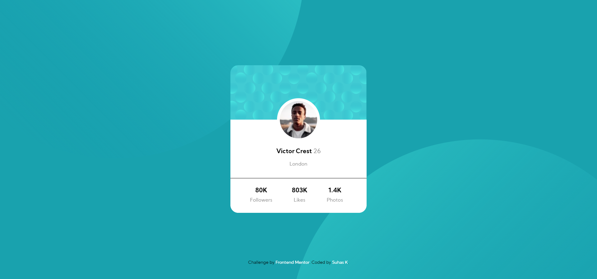

# Frontend Mentor - Profile card component solution

This is a solution to the [Profile card component challenge on Frontend Mentor](https://www.frontendmentor.io/challenges/profile-card-component-cfArpWshJ). Frontend Mentor challenges help you improve your coding skills by building realistic projects. 

## Table of contents

- [Overview](#overview)
  - [The challenge](#the-challenge)
  - [Screenshot](#screenshot)
  - [Links](#links)
- [My process](#my-process)
  - [Built with](#built-with)
  - [What I learned](#what-i-learned)
  - [Continued development](#continued-development)
  - [Useful resources](#useful-resources)
- [Author](#author)
- [Acknowledgments](#acknowledgments)


## Overview

### The challenge

- Build out the project to the designs provided

### Screenshot




### Links

- Solution URL: [https://github.com/suhaasya/profile-card-frontend-mentor-project](https://github.com/suhaasya/profile-card-frontend-mentor-project)
- Live Site URL: [https://suhaasya.github.io/profile-card-frontend-mentor-project/](https://suhaasya.github.io/profile-card-frontend-mentor-project/)

## My process

### Built with

- Semantic HTML5 markup
- CSS custom properties
- Flexbox
- CSS Grid
- Mobile-first workflow


### What I learned


```html

```
```css

#img-top{
    right: 49%;
    bottom: 43%;
    position: fixed;
    transition: 0.5s cubic-bezier(0.075, 0.82, 0.165, 0.6);
    z-index: -1;
}
```
```js

}
```


### Continued development

I would like to give some focus on z index property.


### Useful resources


- [resource 1](https://www.w3schools.com/) - Its best website for documentations.


## Author


- Github - [@Suhaasya](https://github.com/suhaasya?tab=repositories)
- Frontend Mentor - [@suhaasya](https://www.frontendmentor.io/profile/suhaasya)
- Twitter - [@tech_suhas](https://www.twitter.com/tech_suhas)

## Acknowledgments

I would like to thank frontend mentor creators and w3school creators.

